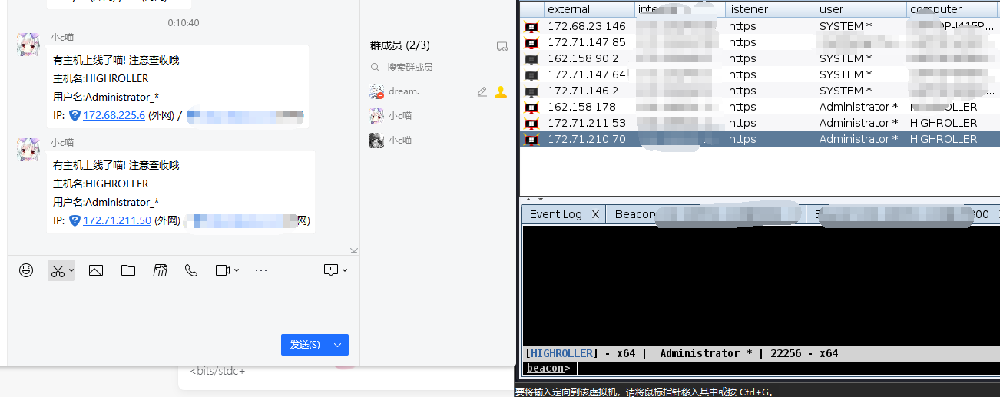
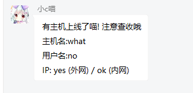

# Cobaltstirke 上线 QQ机器人消息推送



## 实现原理

集成cs和python脚本，通过onebot标准，在主机上线的时候调用消息平台（本项目教程中使用的是[Lagrange](https://github.com/LagrangeDev/Lagrange.Core)），然后qq群收到主机上线的消息

## 配置脚本

使用之前，你需要在onebot.py中更新你要发送消息的qq群
以及你在lagrange配置的token
```python
api_host = "127.0.0.1"
api_port = 8083
api_group = 114514
access_token = "changeme"
```

## 配置Lagrange

_如果你不知道如何部署Lagrange_，请移至 [在x64 Linux上部署Lagrange.Onebot (QQ消息平台) - 残酷世界的传说 (yamero.cc)](https://blog.yamero.cc/archives/1718259889489)

欲发送消息到QQ，我们首先需要与消息平台通信，再由消息平台直接联系腾讯服务器

那么怎么与消息平台通信呢？我们可以使用lagrange的API，这符合Onebot V11的标准

首先，需要在lagrange开启http监听器

在 Implementations 下面添加:
```json
{
    "Type": "Http",
    "Host": "127.0.0.1",
    "Port": 8083,
    "AccessToken": "changeme"
}
```

其中AccessToken是客户端发送get请求时的密钥

可以自己先试一下代码，看看消息能不能发出去
`python3 onebot.py what no yes ok`

正常的情况是这样的：



## Agressor Script部分

如果client里面没有agscript，你需要自己创建一个
`echo "java -XX:ParallelGCThreads=4 -XX:+AggressiveHeap -XX:+UseParallelGC -javaagent:uHook.jar -classpath ./cobaltstrike-client.jar aggressor.headless.Start $*" > agscript`
`chmod +x agscript`

注意要把cobaltstrike-msg.cna里面的onebot.py改为你的python脚本路径

保存后，输入

`./agscript 127.0.0.1 端口 agent cs服务端的密码 cobaltstrike-msg.cna`
即可产生一个持续的脚本客户端，连接到我们的cs服务端